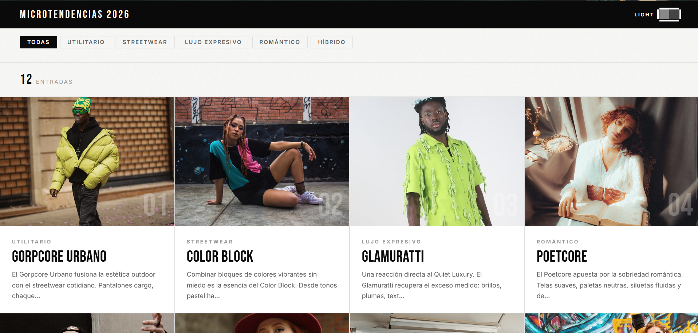
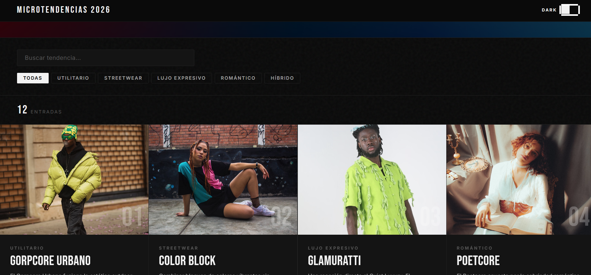
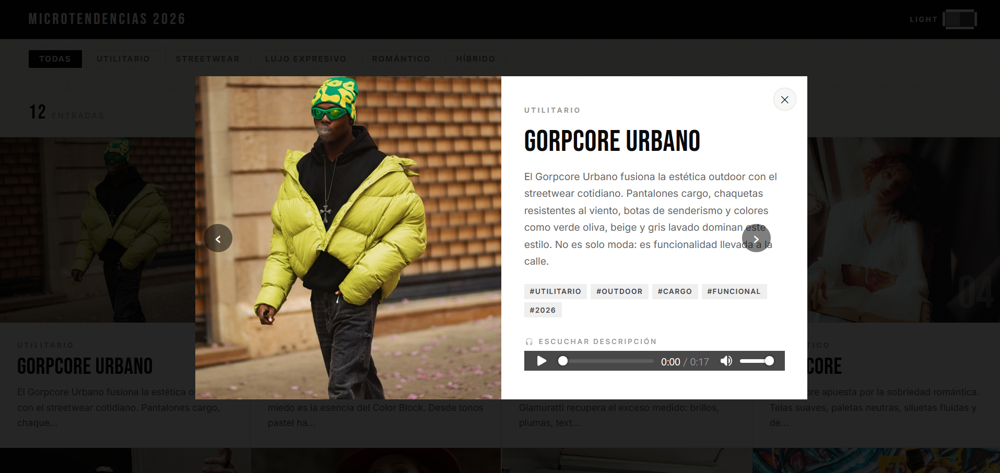

# Enciclopedia de Microtendencias 2026

Proyecto Personal — IF7102 Multimedios | I Ciclo 2026
**Estudiante:** José Daniel Solís Cordoncillo | C37683
**Opción:** 4 — Enciclopedia Temática Interactiva
**Framework:** React 19 + Vite

---

## Descripción

Enciclopedia web interactiva que documenta 12 microtendencias de moda urbana vigentes en 2026. Permite explorar cada tendencia con imágenes, descripciones, audio narrativo y filtros por categoría. Diseño editorial en blanco y negro con tipografía bold, modo oscuro y animaciones de entrada.

---

## Funcionalidades

- Búsqueda en tiempo real por nombre de tendencia
- Filtros por categoría: Streetwear, Utilitario, Romántico, Híbrido, Lujo Expresivo
- Modal con imagen completa, descripción, tags y audio al hacer clic en una card
- Navegación entre entradas dentro del modal (flechas prev/next)
- Modo oscuro / claro con toggle pixel-art
- Audio descriptivo con narración en 3 entradas
- Animaciones de entrada progresivas en las cards
- Scroll suave al seleccionar filtro de categoría
- Estado de carga con spinner animado
- Contador de entradas filtradas
- Diseño responsivo para móvil y escritorio

---

## Tecnologías utilizadas

- React 19
- Vite 8
- CSS Variables (theming modo oscuro/claro)
- Google Fonts — Bebas Neue + Inter
- gh-pages (deploy)

---

## Instrucciones de ejecución

### Requisitos previos
- Node.js 18 o superior
- npm

### Pasos

```bash
# 1. Clonar el repositorio
git clone https://github.com/Dann233/proyectopersonal-enciclopedia-c37683.git

# 2. Entrar a la carpeta
cd proyectopersonal-enciclopedia-c37683

# 3. Instalar dependencias
npm install

# 4. Levantar servidor de desarrollo
npm run dev
```

La aplicación estará disponible en `http://localhost:5173/proyectopersonal-enciclopedia-c37683/`

### Build y deploy

```bash
# Construir para producción
npm run build

# Desplegar en GitHub Pages
npm run deploy
```

---

## Demo en línea

[https://dann233.github.io/proyectopersonal-enciclopedia-c37683/](https://dann233.github.io/proyectopersonal-enciclopedia-c37683/)

---

## Capturas de pantalla

### Vista principal — Modo claro


### Vista principal — Modo oscuro


### Modal de tendencia


---

## Estructura del proyecto

```
proyectopersonal-enciclopedia-c37683/
├── screenshots/
│   ├── home-light.png
│   ├── home-dark.png
│   └── modal.png
├── src/
│   ├── components/
│   │   ├── Navbar.jsx          # Barra de navegación con toggle modo oscuro pixel-art
│   │   ├── SearchBar.jsx       # Input de búsqueda en tiempo real
│   │   ├── FilterBar.jsx       # Botones de filtro por categoría con scroll suave
│   │   ├── EntradaCard.jsx     # Tarjeta reutilizable de cada tendencia
│   │   ├── AudioPlayer.jsx     # Reproductor de audio reutilizable
│   │   └── Modal.jsx           # Modal con info completa y navegación prev/next
│   ├── styles/
│   │   ├── App.css             # Estilos de componentes y layout
│   │   └── index.css           # Variables CSS globales y tipografía
│   ├── App.jsx                 # Componente principal con lógica React
│   └── main.jsx                # Punto de entrada
├── public/
│   ├── audio/
│   │   ├── audio_gorpcore.mp3
│   │   ├── audio_colorblock.mp3
│   │   └── audio_glamuratti.mp3
│   └── data/
│       └── tendencias.json     # Datos de las 12 tendencias
├── index.html
├── vite.config.js
├── package.json
├── README.md
└── REFERENCIAS.md
```

---

## Componentes React utilizados

| Componente | Hook principal | Función |
|---|---|---|
| App | useState, useEffect, useMemo | Lógica central, estado global |
| Navbar | — | Toggle modo oscuro |
| SearchBar | — | Input controlado |
| FilterBar | — | Filtros de categoría con scroll suave |
| EntradaCard | — | Tarjeta reutilizable con props |
| AudioPlayer | — | Reproductor con BASE_URL dinámico |
| Modal | — | Vista detallada con navegación prev/next |